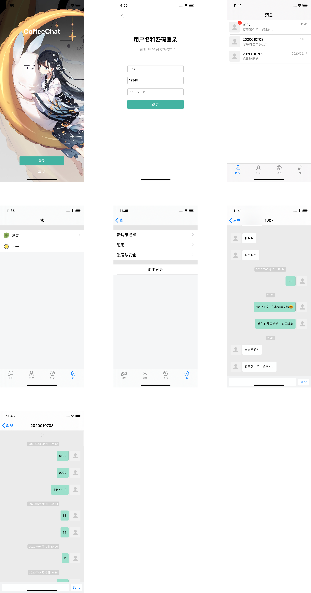

# CoffeeChat

opensource im with server(go) and client(flutter+swift)

## News

有网友在Issues询问后续更新一事，这里回复一下：
> 今年事情比较多，所以进展十分缓慢，会不会放弃这个项目我也不能肯定，主要是作者精力有限，请大家原谅。发起这个项目的初衷，是为了更深入的学习IM服务端开发，如果有更好的开源go语言实现的im项目，我可能会考虑作为Contributor参与其中。从目前来看，OpenIM可能性很大。

最后，放出最近的一些动态以感谢大家的关心。

最新动态：
- 至今: 生命不息，探索不止💪💪
- 2021/08: 作者最近在考虑跳槽，故精力主要放在研究[OpenIM](https://github.com/OpenIMSDK/Open-IM-Server)，学习Kafka，微服务，收件箱，Etcd，Docker，K8S等使用，提升技术深度。
- 2021/03 - 07: 开发QT客户端和C++跨平台SDK，受限于精力进展缓慢。
- 2021/02: 使用sketch设计win+mac客户端界面。

总结：
- `2021`: 主要精力在探索百万级的架构，C++跨平台SDK，QT，Go微服务，Docker，Etcd等等，coffeechat几乎没有更新
- `2020`: 这一年coffeechat不断完善，作者主要在学习ios开发，实现简单ios app
- `2019/08`: coffeechat诞生，学习flutter，实现简单flutter客户端，后续因为flutter聊天界面下拉感觉效果不理想放弃

## Preview

### flutter

see [CoffeeChat-Flutter](https://github.com/xmcy0011/CoffeeChat-Flutter)

### swift
  

## Features

### 设计

- [x] 架构设计：参考瓜子 IM
- [x] 协议设计：参考网易云 IM、环信、TeamTalk
- [x] 数据库设计
- [x] 消息分表存储设计
- [x] IM 消息 ID 生成设计

### 单聊群聊

- [x] flutter 客户端
- [x] 单聊
- [x] 多媒体消息：文本
- [x] 会话列表
- [x] 消息存储
- [x] 历史消息
- [x] 漫游消息（用户切换到任何设备都可以读取到最近的历史消息）
- [ ] 离线消息（用户离线重新上线后收到最近 30 天的未读消息）
- [ ] 多媒体消息：表情
- [ ] 多媒体消息：图片
- [x] 未读消息计数
- [ ] 消息推送(APNS)

- [ ] 群聊
- [ ] 群最高人数：200
- [ ] 群管理：群主、加人、踢人
- [ ] 群消息免打扰
- [ ] 群成员管理

### 服务端特有

- [ ] 负载均衡
- [ ] 双机容灾
- [ ] 性能压测 Benchmark
- [ ] 业务监控
- [ ] Redis 集群
- [ ] docker
- [ ] 阿里云OSS对象存储接入（40GB存储一年7块，每月100GB下行带宽一年200）
- [ ] antispam

## 客户端特有

- [ ] 消息推送提醒（系统通知栏消息提醒）
- [ ] 消息转发
- [ ] 网络连接状态
- [ ] 图片管理器
- [ ] 查找聊天记录
- [ ] 消息同步缓存
- [x] 会话同步缓存
- [ ] 头像同步缓存
- [ ] 未读计数桌面角标
- [ ] 免打扰模式
- [ ] 图片压缩

### 特色功能

- [ ] 阅后即焚
- [ ] 撤回
- [ ] 正在输入
- [ ] 已读回执（用户发送消息，获取对方是否已读状态 ）
- [ ] 多终端已读同步（同个产品多终端情况下，同步消息已读未读的状态）
- [ ] 端到端加密
- [ ] 高清语音消息
- [ ] 文件上传下载
- [x] 语音通话(声网FlutterSDK)
- [ ] 视频通话
- [ ] electron 跨平台桌面客户端
- [x] flutter 跨平台移动端
- [ ] swift/iOS 客户端+SDK
- [ ] kotlin/Android 客户端+SDK
- [ ] vue/Web 客户端+SDK

### 客服功能

- [ ] 客服会话
- [ ] 欢迎语
- [ ] 自动分配在线客服
- [ ] 客服正在输入提醒
- [ ] 回头客

### 智能问答功能

- [ ] AnyQ 百度开源 FAQ 问答系统接入

### 聊天机器人功能

- [ ] 图灵机器人接入
- [ ] 小爱机器人接入
- [x] 思知机器人接入
- [x] 微信机器人接入

## Architecture

总体架构:  


逻辑架构:  


模块架构:  


单聊模块交互图:


See More [architecture](https://github.com/xmcy0011/CoffeeChat/blob/master/docs/02-%E6%9E%B6%E6%9E%84%E5%92%8C%E5%8D%8F%E8%AE%AE%E8%AE%BE%E8%AE%A1.md)

## Quick Start

### Build

> PS：请切换到**master**分支，编译和运行！

#### client

目前仅支持 Flutter 客户端，在 ios11 模拟器下测试通过。仅测试了登录登出、单聊、发文本、未读消息计数等功能。

1. Flutter 安装，请参考 [官网](https://flutter.cn/docs/get-started/install)
2. 下载 IntelliJ IDEA Ultimate，[链接](https://www.jetbrains.com/idea/)
3. 使用 idea 打开 cc_flutter_app
4. 打开终端，初始化项目，命令如下

```bash
cd client/cc_flutter_app
flutter pub get
```

5. 点击 Open IOS Simulator，等待模拟器启动
6. 点击 Run 图标

#### server(以 mac 环境为例)

> 2020.04.20 更新：使用go mod包管理工具代替dep。

1. 安装golang（推荐**go1.13**以上，安装方法请以 [官网](https://golang.google.cn/dl/) 为准）

```bash
$ brew isntall golang # 安装go
$ vim ~/.bash_profile # 设置go环境变量

export GOROOT=/usr/local/Cellar/go/1.16.3/libexec
# 自go1.13默认启用go mod后，GOPATH可以不在配置
#export GOPATH="/Users/xmcy0011/repo/go" # 使用go mod后，代码不能存放到gopath下，请注意。
export GOBIN=$GOROOT/bin
export PATH=$PATH:$GOBIN:$GOPATH/bin 

$ source ~/.bash_profile # 生效
$ go env                 # 确认goroot和gopath正确

$ unset GOPROXY          # go mod有些包拉不下来，可以配置GOPROXY。但是，对go get无效😭
$ go env -w GOPROXY=https://goproxy.cn,direct
```

2. git clone
```bash
$ cd /Users/xmcy0011/repo #注意不是gopath路径！
$ mkdir github
$ cd github
$ git clone https://github.com/xmcy0011/CoffeeChat.git
```

3. build & run
- 手工方式
```bash
# gate 网关服务编译
$ cd server/src/app/im_gate
$ go build -v
$ ./im_gate -conf=./gate-example.toml

# logic 逻辑服务编译
$ cd server/src/app/im_logic
$ go build -v
$ ./im_logic -conf=./logic-example.toml
```
- 使用脚本
```bash
$ cd server/src
$ chmod 777 build.sh
# 编译并打包
$ ./build.sh version 2021-04-20
# 解压，通过./restart.sh ./stop.sh等脚本启动和停止服务
$ tar -zxvf coffeechat.2021-04-20.tar.gz
```

### Run

1. client see [here](https://github.com/xmcy0011/CoffeeChat/blob/master/client/cc_flutter_app/README.md)
2. server see [here](https://github.com/xmcy0011/CoffeeChat/blob/master/server/src/README.md)

### Document

1. [产品介绍](https://github.com/xmcy0011/CoffeeChat/blob/master/docs/01-%E4%BA%A7%E5%93%81%E4%BB%8B%E7%BB%8D.md)
2. [架构和协议设计](https://github.com/xmcy0011/CoffeeChat/blob/master/docs/02-%E6%9E%B6%E6%9E%84%E5%92%8C%E5%8D%8F%E8%AE%AE%E8%AE%BE%E8%AE%A1.md)
3. [消息分表存储](https://github.com/xmcy0011/CoffeeChat/blob/master/docs/03-%E6%B6%88%E6%81%AF%E5%88%86%E8%A1%A8%E5%AD%98%E5%82%A8.md)
4. [IM 消息 ID 生成原理和常见技术难点](https://github.com/xmcy0011/CoffeeChat/blob/master/docs/04_IM%e5%b8%b8%e8%a7%81%e6%8a%80%e6%9c%af%e9%9a%be%e7%82%b9.md)
5. [进度计划](https://github.com/xmcy0011/CoffeeChat/blob/master/docs/05-%E8%BF%9B%E5%BA%A6%E8%AE%A1%E5%88%92.md)
6. [MQ在IM中的实践和选型](https://github.com/xmcy0011/CoffeeChat/blob/master/docs/06_MQ%e5%9c%a8IM%e4%b8%ad%e7%9a%84%e5%ae%9e%e8%b7%b5.md)

## Contact

email:xmcy0011@sina.com

## LICENSE

CoffeeChat is provided under the [mit license](https://github.com/xmcy0011/CoffeeChat/blob/master/LICENSE).