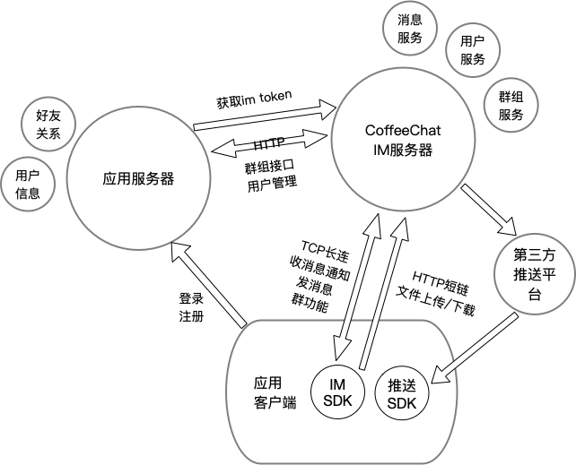
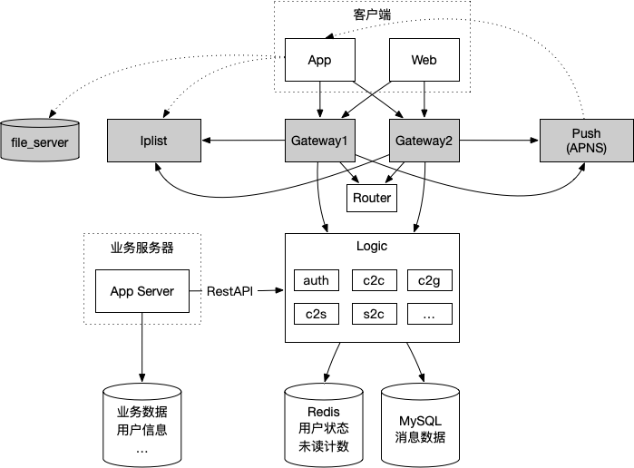
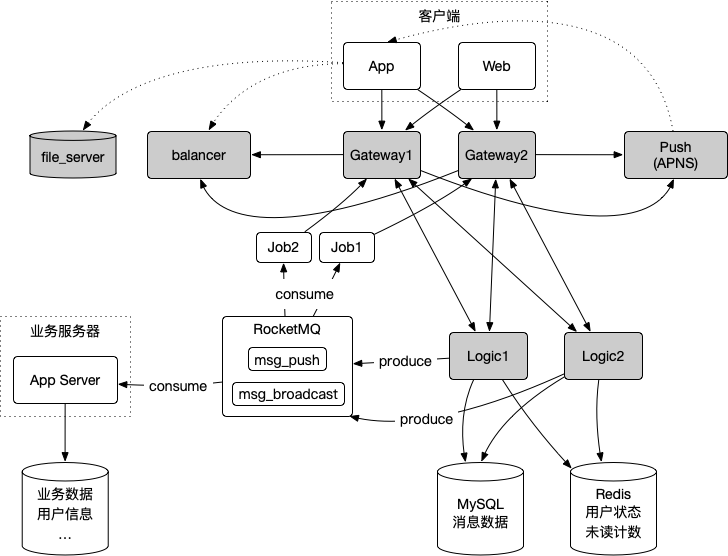
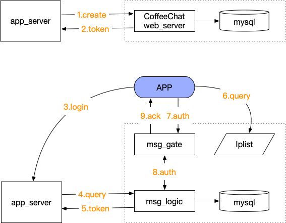
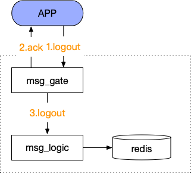
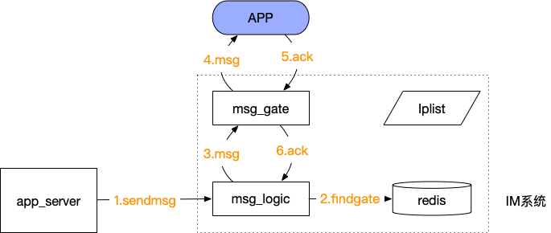
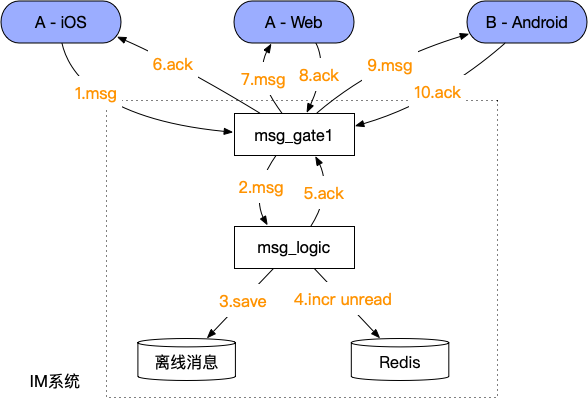
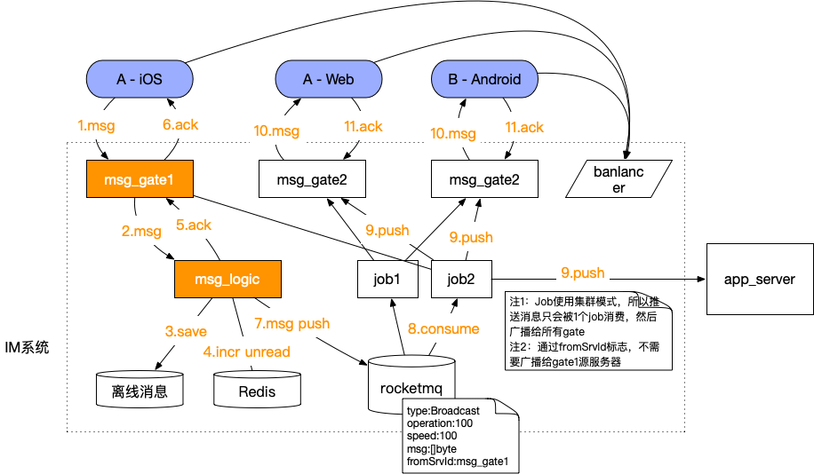
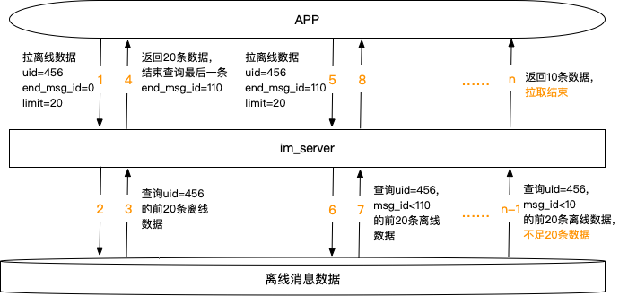

参考：  
[手把手教你开发生产级 IM 系统](https://mp.weixin.qq.com/s/_Direcn6tk2P2KDpncFdgQ)  
[从零开始搭建瓜子 IM 系统](https://mp.weixin.qq.com/s/TUIxcg0EJC0S26gKrKqYKg)  
[一个海量在线用户即时通讯系统（IM）的完整设计](https://mp.weixin.qq.com/s?__biz=MzI1ODY0NjAwMA==&mid=2247483756&idx=1&sn=a8e3303bc573b1acaf9ef3862ef89bdd&chksm=ea044bf3dd73c2e5dcf2c10202c66d6143ec866205e9230f974fbc0b0be587926699230b6b18#rd)  
[基于消息总线的高可扩展性 IM 系统后台架构设计](https://mp.weixin.qq.com/s/a4sDH48PWTHax2uBej1Jtg)  
[低成本确保消息时序的方法](https://mp.weixin.qq.com/s/QtlgYtfek4Sv8Ss5b8ojxA)  
[别人读没读你的消息，你如何知道？](https://mp.weixin.qq.com/s/4URbQUeyTOcm1xtTwfjqUA)  
[ID 生成策略——SnowFlake](https://mp.weixin.qq.com/s/p_cANKSn5hFxHo-YzzYs-A)  
[架构成长之路：9 种高性能高可用高并发的技术架构](https://www.jianshu.com/p/b067266bbdf4)  
[golang 写的 IM 服务器](https://github.com/alberliu/goim)  
[goim v2.0-高性能聊天室](https://github.com/Terry-Mao/goim)  
[快速裂变：见证微信强大后台架构从 0 到 1 的演进历程（一）](http://www.52im.net/thread-168-1-1.html)  
[今日头条架构演进之路——高压下的架构演进专题](https://www.jianshu.com/p/6c879e132093)  
[微信技术分享：微信的海量 IM 聊天消息序列号生成实践（算法原理篇）](http://www.52im.net/thread-1998-1-1.html)

特别感谢公众号：普通程序员，**封宇**大神的系列 IM 分享文章 🙏。

<!-- TOC -->

- [1 服务端设计](#1-服务端设计)
    - [1.1 总体架构](#11-总体架构)
    - [1.2 逻辑架构](#12-逻辑架构)
        - [1.2.1 用户端](#121-用户端)
        - [1.2.2 用户端 API](#122-用户端-api)
        - [1.2.3 接入层](#123-接入层)
        - [1.2.4 逻辑层](#124-逻辑层)
        - [1.2.5 存储层](#125-存储层)
    - [1.3 模块架构](#13-模块架构)
        - [1.3.1 登录授权(auth)](#131-登录授权auth)
        - [1.3.2 登出(logout)](#132-登出logout)
        - [1.3.3 踢人(kickout)](#133-踢人kickout)
        - [1.3.4 上报(c2s)](#134-上报c2s)
        - [1.3.5 推送(s2c)](#135-推送s2c)
        - [1.3.6 单聊(c2c)](#136-单聊c2c)
            - [用户(grpc)](#用户grpc)
            - [机器人](#机器人)
        - [1.3.7 群聊(c2g)](#137-群聊c2g)
        - [1.3.8 拉取离线消息(pull)](#138-拉取离线消息pull)
            - [1）查询会话列表(session)，包含未读计数](#1查询会话列表session包含未读计数)
            - [2）查询历史消息(msglog)](#2查询历史消息msglog)
        - [1.3.9 已读回执](#139-已读回执)
        - [1.3.10 撤回](#1310-撤回)
        - [1.3.11 音视频实时通话](#1311-音视频实时通话)
    - [1.4 推送平台](#14-推送平台)
- [2 协议设计](#2-协议设计)
    - [2.1 协议组成](#21-协议组成)
    - [2.2 协议头设计](#22-协议头设计)
    - [2.3 数据部设计](#23-数据部设计)
        - [2.3.1 认证授权](#231-认证授权)
        - [2.3.2 登出](#232-登出)
        - [2.3.3 心跳](#233-心跳)
        - [2.3.4 消息](#234-消息)
            - [文件消息](#文件消息)
            - [位置消息](#位置消息)
            - [机器人消息](#机器人消息)
        - [2.3.5 拉消息](#235-拉消息)
            - [2.3.5.1 最近聊天会话列表请求](#2351-最近聊天会话列表请求)
            - [2.3.5.2 历史离线消息](#2352-历史离线消息)
- [3 存储设计](#3-存储设计)
    - [3.1 mysql 数据库](#31-mysql-数据库)
        - [3.1.1 会话表](#311-会话表)
        - [3.1.2 发送消息表](#312-发送消息表)
        - [3.1.3 接收消息表](#313-接收消息表)
        - [3.1.4 群组表](#314-群组表)
        - [3.1.5 群成员表](#315-群成员表)
        - [3.1.6 水平分库](#316-水平分库)
    - [3.2 redis 缓存](#32-redis-缓存)

<!-- /TOC -->

# 1 服务端设计

## 1.1 总体架构



## 1.2 逻辑架构


客户端从 Iplist 服务获取接入层 IP 地址（也可采用域名的方式解析得到接入层 IP 地址），建立与接入层的连接（可能为短连接），从而实现客户端与 IM 服务器的数据交互；业务线服务器可以通过服务器端 API 建立与 IM 服务器的联系，向客户端推送消息；客户端上报到业务服务器的消息，IM 服务器会通过 mq 投递给业务服务器。

### 1.2.1 用户端

移动端以 iOS 为主，全部使用 Swift 编写。后续增加顺序可能是：Flutter->Android->WebSocket 等客户端。客户端主要用来演示 SDK 功能，后续根据场景可能会考虑增加如电商、教育等 demo。

### 1.2.2 用户端 API

针对 TCP 协议，提供 IOS/Android 开发 SDK。对于 H5 页面，提供 WebSocket 接口

### 1.2.3 接入层

接入层主要任务是保持海量用户连接（接入）、攻击防护、将海量连接整流成少量 TCP 连接与逻辑层通讯。

### 1.2.4 逻辑层

逻辑层负责 IM 系统各项功能的核心逻辑实现。包括单聊（c2c）、上报(c2s)、推送(s2c)、群聊(c2g)、离线消息、登录授权、组织机构树等等内容。

### 1.2.5 存储层

存储层负责缓存或存储 IM 系统相关数据，主要包括用户状态及路由（缓存），消息数据（MySQL 也可采用 NoSql，如 MangoDB），文件数据（文件服务器）。

## 1.3 模块架构

  
除 Router 之外其他服务都是无状态设计，可以支持分布式部署。通常前期推荐每个服务部署双节点冗余，以提高可用性。

> 2020.06.09 更新-------------  
> PS：目前并没有实现分布式部署的功能。
> logic广播给gate，通过MQ完成，削峰、解耦、吞吐量、实时/离线统计计算。

以下是基于MQ的架构（为什么是RocketMQ，见[MQ在IM中的实践和选型](../docs/06_MQ%e5%9c%a8IM%e4%b8%ad%e7%9a%84%e5%ae%9e%e8%b7%b5.md)）：  


为什么要引入MQ？为了解决什么问题？
答：假设单台gate服务器支持5万个用户同时在线，为了支持100万个用户同时在线，需要部署20台gate服务器。gate之间需要一种机制能进行通信（用户不一定在同一台服务器上登录），简单点所有的gate都连接一个router，来中转广播。但是这样router就存在单点故障了，所以引入MQ就是为了解决router单点以及性能的问题。另一方面，如果有一些数据分析任务，也可以从mq里面拿数据进行实时分析。

> PS：见rocketmq分支，目前已实现logic/gate接入MQ，以及job服务，初步验证了登录在2台Gate上的用户可收发消息。

### 1.3.1 登录授权(auth)

  
AppServer：客户的应用服务器，非 CoffeeChat 提供

1. 第三方帐号在用户注册时通过 HTTP 接口导入到 CoffeeChat 平台，传递 UID、昵称（用来 push 推送时显示的昵称）、头像 URL 等。
2. 返回注册结果和 token，token 可以在 app_server 存储，直到用户修改密码后才被更新，以实现自动登录。
3. 客户端登录应用服务器，进行账号密码校验。
4. 应用服务器校验成功后，向 msg_logic 查询 token。
5. msg_logic 返回 uid 对应的 token。
6. 客户端通过域名查询到 msg_gate 服务器地址（实现负载均衡）。
7. 客户端通过 tcp 连接 msg_gate 后，使用 uid 和 token 发起授权验证请求，msg_gate 同步 rpc 调用 msg_logic。
8. msg_logic 验证 token 合法性，验证成功后把客户端状态记录在 redis 中并设置为在线。
9. msg_gate 得到验证结果后，设置 session 状态，并向客户端返回验证结果。

### 1.3.2 登出(logout)



1. 客户端向 msg_gate 发送登出请求。
2. msg_gate 给客户端回复响应。
3. msg_gate 通知 msg_logci 用户登出。

### 1.3.3 踢人(kickout)

暂不支持。

### 1.3.4 上报(c2s)

暂不支持。

### 1.3.5 推送(s2c)



1. 业务线调用 push 数据接口 sendmsg
2. Logic 向 redis 检索目标用户状态。如果目标用户不在线，丢弃数据（未来可根据业务场景定制化逻辑）；如果用户在线，查询到用户连接的接入层 gate
3. Logic 向用户所在的 gate 发送数据
4. Gate 向用户推送数据。（如果用户不在线，通知 logic 用户不在线）
5. 客户端收到数据后向 gate 发送 ack 反馈
6. Gate 将 ack 信息传递给 logic 层，用于其他可能的逻辑处理（如日志，确认送达等）

### 1.3.6 单聊(c2c)

#### 用户(grpc)


1. App1 向 gate1 发送信息（信息最终要发给 App2）
2. Gate1 将信息投递给 logic
3. Logic 收到信息后，将信息进行存储
4. 存储成功后，logic 向 gate1 发送 ack
5. Gate1 将 ack 信息发给 App1
6. Logic 检索 redis，查找 App2 状态。如果 App2 未登录，流程结束
7. 如果 App2 登录到了 gate2，logic 将消息发往 gate2
8. Gate2 将消息发给 App2（如果发现 App2 不在线，丢弃消息即可，这种概率极低，后续离线消息可保证消息不丢）
9. App2 向 gate2 发送 ack
10. Gate2 将 ack 信息发给 logic
11. Logic 将消息状态设置为已送达。

注：在第 6 步和第 7 步之间，启动计时器（DelayedQueue 或哈希环，时间如 5 秒），计时器时间到后，探测该条消息状态，如果消息未送达，考虑通过 APNS、米推、个推进行推送

> ——2020.07.12 更新  

实际中有点出入：
- master分支（单机版）  
目前master分支是单机版本，只需要部署gate和logic，gate和logic之间通过gRPC通信。2msg和4msg其实就是一个函数的入参数和返回值，使用gRPC简化了不少。


- rocketmq分支（集群版）  
目前rocketmq分支还在开发中，并且可能不会发布。


#### 机器人


1. App1 向 gate1 发送信息（信息最终要发给聊天机器人，获取回复）
2. Gate1 将信息投递给 logic
3. Logic 收到信息后，将信息进行存储
4. 存储成功后，logic 向 gate1 发送 ack
5. Gate1 将 ack 信息发给 App1
6. Gate1 调用聊天机器人HTTP API
7. 聊天机器人给出了回复
8. Gate1 将机器人回复的信息投递给 logic
9. Logic 收到信息后，将信息进行存储
10. 存储成功后，logic 向 gate1 发送 ack
11. Gate1 转发机器人消息给 App1
12. APP1 收到消息回复 ack。

注1：目前仅支持思知机器人，为了方便测试，默认建了对应的机器人。如需更换，请访问：https://console.ownthink.com/dashboard/settings/42ad915bb184f2bd5eee7df8e7efd102  
注2：参考网易云的机器人文档，和普通消息有所区别的是，机器人消息包含 上行（用户发的原始文本） 和 下行（机器人回答）。可参考：https://dev.yunxin.163.com/docs/product/IM即时通讯/产品介绍/智能对话机器人服务  
注3：相比和用户的单聊，这里不需要记录消息状态  

### 1.3.7 群聊(c2g)

采用扩散写（而非扩散读）的方式。  
群聊是多人社交的基本诉求，一个群友在群内发了一条消息：  
（1）在线的群友能第一时间收到消息  
（2）离线的群友能在登陆后收到消息  
由于“消息风暴扩散系数”的存在，群消息的复杂度要远高于单对单消息。  
群基础表：用来描述一个群的基本信息  
im_group_msgs(group_id, group_name,create_user, owner, announcement, create_time)  
群成员表：用来描述一个群里有多少成员  
im_group_users(group_id, user_id)  
用户接收消息表：用来描述一个用户的所有收到群消息（与单对单消息表是同一个表）  
im_message_recieve（msg_id,msg_from,msg_to, group_id，msg_seq, msg_content, send_time, msg_type, deliverd, cmd_id）  
用户发送消息表：用来描述一个用户发送了哪些消息  
im_message_send (msg_id,msg_from,msg_to, group_id，msg_seq, msg_content, send_time, msg_type, cmd_id)  
业务场景举例：  
（1）一个群中有 x,A,B,C,D 共 5 个成员，成员 x 发了一个消息  
（2）成员 A 与 B 在线，期望实时收到消息  
（3）成员 C 与 D 离线，期望未来拉取到离线消息（同时通过系统级推送通道推送离线消息）  
群聊流程如下图所示  


1. X 向 gate 发送信息（信息最终要发给这个群，A、B 在线）
2. Gate 将消息发给 logic
3. 存储消息到 im_message_send 表，按照 msg_from 水平分库
4. 回 ack
5. 回 ack
6. Logic 检索数据库（需要使用缓存），获得群成员列表
7. 存储每个用户的消息数据（用户视图），按照 msg_to 水平分库(并发、批量写入)。
8. 查询用户在线状态及位置
9. Logic 向 gate 投递消息
10. Gate 向用户投递消息
11. App 返回收到消息的 ack 信息
12. Gate 向 logic 传递 ack 信息
13. 向缓存（Hash）中更新收到 ack 的时间。然后在通过一个定时任务，每隔一定时间，将数据更新到数据库（注意只需要写入时间段内有变化的数据）。

### 1.3.8 拉取离线消息(pull)

参考文章（基于 TimeLine 模型的消息同步机制 https://mp.weixin.qq.com/s/0eKfIRy8zpCpMrrF15Uigg）  
目前 CoffeeChat 基于简单的消息同步方法：

1. 把消息存储到 mysql
2. 向在线用户推送消息（离线则走 push 通道）
3. 在线用户返回收到消息的 ack 信息

对于离线用户，登录后直接拉取离线消息即可，包含 2 部分：一次性查询会话列表和按需拉取某个会话下的历史聊天记录，后续再考虑增加基于 TimeLine 模型的消息同步功能。

#### 1）查询会话列表(session)，包含未读计数


1. 客户端向 msg_gate 请求会话列表。
2. msg_logic 异步处理查询请求，通过线程池+消息队列的方式。
3. msg_logic 从 mysql 中获取用户的所有会话列表，每个会话对应的最新消息 id 和内容等。
4. msg_logic 从 redis 中补全每个会话的未读消息数量。
5. msg_logic 回复响应。
6. msg_gate 转发响应给客户端。

#### 2）查询历史消息(msglog)



1. App 端登录成功，点击某个聊天后，向 IM 系统发起拉历史离线消息请求。传递 3 个主要参数，uid 表示用户；end_msg_id 表示当前收到的最小消息 id（如果没收到过消息，或拿不到最小消息 id 则为 0）即可；limit 表示每次拉取条数（这个值也可以由服务器端控制）。
2. end_msg_id 为 0，查询最新的 20 条数据。
3. im_server 查询用户前 20 条离线消息。
4. 将离线消息推给用户。假设这 20 条离线消息最后一条（最小）end_msg_id=110。
5. App 得到数据，判断得到的数据不为空（消息数目返回的数值等于请求的 limit），继续发起拉取操作。end_msg_id=110(取得到的离线消息中最后的一条，即 ID 最小的一条)。
6. 无。
7. 查询 end_msg_id<110 的钱 20 条离线数据。
8. 返回给 App。
9. N-1 查询 end_msg_id>10 的离线数据，不足 20 条（没有离线数据了）。
10. N 将数据返回 App，App 判断拉取不足 20 条数据，结束离线拉取过程。

注：上述是拉取所有聊天记录的完整过程，实际中是根据用户滑动操作按需拉取的。

说明：  
- 针对群聊消息的拉取，非常简单。直接按照groupId分页查询即可。  
- 对于单聊消息，只检索双方的发送消息表（可能不在一个分库），每个表都检索出20条记录，然后使用拉链法聚合，返回最近的20条记录即可。
```go
// 计算a 和 b 发送消息表的名字（取余数，拼接表名字）
tableNameA := fmt.Sprintf("im_message_send_%d",userId%kIMMessageTableCount)
tableNameB := fmt.Sprintf("im_message_send_%d",sessionId%kIMMessageTableCount)

// 查询A发送的消息
sql = fmt.Sprintf("select msg_id,client_msg_id,from_id,to_id,group_id,msg_type,msg_content,"+
				"msg_res_code,msg_feature,msg_status,created,updated from %s"+
				" force index(ix_fromId_toId_msgStatus_created)"+
				" where from_id=%d and to_id=%d"+
				" order by msg_id desc,created limit %d",
        tableNameA, userId, sessionId, limitCount)

// 查询B发送的消息
sql = fmt.Sprintf("select msg_id,client_msg_id,from_id,to_id,group_id,msg_type,msg_content,"+
  "msg_res_code,msg_feature,msg_status,created,updated from %s"+
  " force index(ix_fromId_toId_msgStatus_created)"+
  " where from_id=%d and to_id=%d"+
  " order by msg_id desc,created limit %d",
  tableNameB, sessionId, userId, limitCount)

// ……省略读取的步骤

// 从小到大升序排序（最新消息放最后，符合自然浏览顺序）
sort.Slice(msgArr, func(i, j int) bool {
  //return msgArr[i].Created < msgArr[j].Created && msgArr[i].MsgId < msgArr[j].MsgId
  // fixed 2020.01.11 对话顺序问题
  return msgArr[i].MsgId < msgArr[j].MsgId
})

// 返回部分前20条
if len(msgArr) > int(limitCount) {
  return msgArr[len(msgArr)-int(limitCount):], nil
} else {
  return msgArr, nil
}
```


### 1.3.9 已读回执

### 1.3.10 撤回

### 1.3.11 音视频实时通话


为什么需要自己实现信令？
思考：
实现类微信语音通话如何知道有用户语音呼叫我？
Agora RTC SDK的API文档中有onUserJoined、onUserOffline2个回调，前者是当我在频道内时，如果有某个用户加入时触发。那我作为被呼叫方（即有xx邀请我加入xx频道），SDK中是否有相关接口，监听有人邀请我加入某频道？

> 官方答复：
> 你好，
> 
> 这部分需要集成信令配合实现的哦。
> Agora RTC SDK 提供的是实时视频/语音通话功能，而视频呼叫邀请属于信令系统的功能之一。
> 您可以通过同时集成 Agora RTC SDK 和 Agora RTM SDK 来实现呼叫邀请的功能。
> 请参考相关 API 文档：https://docs.agora.io/cn/Real-time-Messaging/API%20Reference/RTM_java/index.html#callinvitation
> 视频呼叫邀请 Demo：https://github.com/AgoraIO/Advanced-Video/tree/master/Video-Call-with-Chat
> 
> 当双方都在线时，被叫可通过 acceptRemoteinvitation 方法接受来自对方的呼叫邀请；当被叫不在线时，SDK 会在被叫不在线时不断重发呼叫邀请。若消息发送 30秒后被叫仍未上线，SDK 会返回 LOCAL_INVITATION_ERR_PEER_OFFLINE 错误码。Agora RTM SDK 暂不支持离线推送功能。需要集成第三方信令来实现推送功能。
> 
> 或者您也可以集成第三方信令系统，例如融云、环信等，实现呼叫邀请相关业务场景。

故语音、视频呼叫属于信令的功能部分，Agora RTC SDK没有提供，除非再使用别人的IM SDK。所以，这部分需要我们自己实现，也是工作重点和难点之一。

更多信息请参考：http://note.youdao.com/noteshare?id=c74cc984f5bca943fde0c9287a046f64

## 1.4 推送平台

iOS：使用苹果官方的 APNS 推送，到达率有保障  
Android：  
第一种方案：根据手机来选择对应厂商的推送平台，比如华为、小米、OV、魅族等，到达率相对有保障，但是也会丢。  
第二种方案：也可以选择第三方厂商一键支持所有手机，比如极光、米推、个推，免费的效果很差并且有条数限制。  
第三种方案：可以选择真后台保活或者申请应用白名单。  
以上方案可以结合使用，总体而言，推送比较头疼。和微信、QQ 等不能比，很多 APP 会彼此唤醒，手机厂商会选择把 2 者加入系统白名单等，所以才有那么高的消息到达率。

# 2 协议设计

## 2.1 协议组成

im 协议包含协议头和数据部 2 部分。协议头通过结构体（类）序列化和反序列化实现，数据部使用 protobuf 描述。  
一个 IM 消息，在内存中是这样的：  


## 2.2 协议头设计

任何消息都由 Header 和 Body2 部分组成，Header 部分是固定的，长度一定是 16 字节。而 Body 是可变的，通常由 Header 部分的 cmd_id 决定具体是什么含义。

```c++
typedef struct {
    uint32_t    length;      // 无符号4字节，整包长度=16 + Body.Length()
    uint16_t    version;     // 无符号2字节，目前固定为1
    uint16_t    flag;        // 无符号2字节，标志位（预留）
    uint16_t    service_id;  // 无符号2字节，目标服务ID，以后可能用作路由（预留）
    uint16_t    command_id;  // 无符号2字节，0-65535，命令ID，用于如何解析body
    uint16_t    seq_num;  // 无符号2字节，0-65535，包序号
    uint16_t    reversed; // 无符号2字节，保留位
} CIMHeader_t;
```

## 2.3 数据部设计

具体见 pb 文件夹。  
CIM.Def.proto：消息和数据模型定义  
CIMLogin.proto：登录认证业务。  
CIMList.proto：列表业务。会话（包括未读计数）、历史离线消息等  
CIMMessage.proto：消息业务。收发文本、图片、表情、声音、视频、文件、位置等

### 2.3.1 认证授权

```protobuf
message CIMAuthTokenReq {
  // cmd id:		0x0101
  required uint64 user_id = 1;
  // CoffeeChat不存储用户信息，消息推送时需要显示昵称
  // 基于流量考虑，昵称不放在每条消息中携带
  // 但是如果期间用户更新昵称后，消息推送显示昵称会有延迟，CoffeeChat认为是能接受的
  required string nick_name = 2;
  required string user_token = 3;
  required CIM.Def.CIMClientType client_type = 4;
  optional string client_version = 5;
}

// 用户信息
message CIMUserInfo {
  required uint64 user_id = 1;
  required string nick_name = 2;    // 用户昵称
  optional string attach_info = 11; // 自定义字段
}

message CIMAuthTokenRsp {
  // cmd id:		0x0102
  required uint32 server_time = 1;              // 服务器时间
  required CIM.Def.CIMErrorCode result_code = 2; // 验证结果
  optional string result_string = 3;            // 结果描述
  optional CIM.Def.CIMUserInfo user_info = 4;    // 用户信息
}
```

### 2.3.2 登出

```protobuf
message CIMLogoutReq {
  // cmd id:		0x0103
  required uint64 user_id = 1;
  required CIM.Def.CIMClientType client_type = 2;
}

message CIMLogoutRsp {
  // cmd id:		0x0104
  required uint32 result_code = 1;
}
```

### 2.3.3 心跳

```protobuf
message CIMHeartBeat {
  // cmd id:		0x0105
}
```

### 2.3.4 消息

```protobuf
// 发送消息
message IMMsgData {
  // cmd id:		0x0301
  required uint64 from_user_id = 1; // 消息发送方
  required uint64 to_session_id = 2; // 消息接受方，单聊用户ID，群聊群ID
  required string msg_id = 3;        // 客户端消息ID，唯一（UUID）
  required uint64 create_time = 4;         // 消息创建时间戳(毫秒)
  required CIM.Def.CIMMsgType msg_type = 5; // 消息类型
  required bytes msg_data = 6;             // 消息内容
}

// 消息错误码
enum CIMResCode {
  kCIM_RES_CODE_OK = 0; // 一切正常
  // kCIM_RES_CODE_ERROR = 1;           // 错误
  // kCIM_RES_CODE_Group_NOT_EXIST = 2; // 群不存在
  // kCIM_RES_CODE_IN_BLACK = 3;        // 被接收方加入黑名单
}

// 会话类型
enum CIMSessionType {
  // kCIM_SESSION_TYPE_Invalid = 0;   // 无效会话
  kCIM_SESSION_TYPE_SINGLE = 1; // 单聊
  kCIM_SESSION_TYPE_GROUP = 2;  // 群聊
  // kCIM_SESSION_TYPE_CHAT_ROOM = 3; // 聊天室
  // kCIM_SESSION_TYPE_CONSULT = 4; // 客服
}

// 消息类型
enum CIMMsgType {
  kCIM_MSG_TYPE_TEXT = 1;  // 文本
  kCIM_MSG_TYPE_IMAGE = 2; // 图片
  kCIM_MSG_TYPE_Audio = 3; // 声音
  // kCIM_MSG_TYPE_VIDEO = 4;        // 视频
  // kCIM_MSG_TYPE_LOCATION = 5;     // 位置
  // kCIM_MSG_TYPE_NOTIFACATION = 6; // 系统通知（包括入群出群通知等）
  // kCIM_MSG_TYPE_FILE = 7;         // 文件
  kCIM_MSG_TYPE_TIPS = 8;  // 提醒类型
  kCIM_MSG_TYPE_Robot = 9; // 图灵机器人消息

  // kCIM_MSG_TYPE_CUSTOM = 100; // 自定义
  // kCIM_MSG_TYPE_UNKNOWN = 1000; // 未知类型消息，本地使用，发送时请勿使用
}

// 消息收到回复
message IMMsgDataAck {
  // cmd id:		0x0302
  required uint64 from_user_id = 1;    // 消息发送方
  required uint64 to_session_id = 2; // 消息接受方，单聊用户ID，群聊群ID
  required string msg_id = 3;     // 客户端消息ID，唯一（UUID）
  required CIM.Def.CIMResCode res_code = 4;         // 错误码
  required CIM.Def.CIMSessionType session_type = 5; // 会话类型
  optional uint64 create_time = 6;                 // 创建时间戳(毫秒)
}
```

#### 文件消息

IMMsgData.msg_data为json格式，需要二次解析。
1. 文件
```json
{
  "md5":"e10adc3949ba59abbe56e057f20f883e",         # md5,32位
  "size":"1024123",                                 # 文件大小,B
  "url":"http://file.qiniu.com/15923014023.pdf",    # 上传云端后得到的文件下载地址
  "displayName":"test.pdf",                         # 文件显示名称
  "fileExtension":"pdf",                            # 文件扩展名
  "icoThumbUrl":"http://file.qiniu.com/1124.png"    # 上传云端后得到的文件图标url
}
```

2. 语音
```json
{
  "md5":"e10adc3949ba59abbe56e057f20f883e",         # md5,32位
  "size":"1024123",                                 # 文件大小,B
  "url":"http://file.qiniu.com/15923014023.mp3",    # 上传云端后得到的文件下载地址
  "displayName":"test.mp3",                         # 文件显示名称
  "fileExtension":"pdf",                            # 文件扩展名
  "duration":"120"                                  # 时长，秒
}
```

3. 视频
```json
{
  "md5":"e10adc3949ba59abbe56e057f20f883e",         # md5,32位
  "size":"1024123",                                 # 文件大小,B
  "url":"http://file.qiniu.com/15923014023.mp4",    # 上传云端后得到的文件下载地址
  "displayName":"test.mp4",                         # 文件显示名称
  "fileExtension":"mp4",                            # 文件扩展名
  "duration":"15",                                  # 视频时长，秒
  "width":"1080",                                   # 视频画面宽度
  "height":"1920",                                  # 视频画面高度
  "thumbUrl":"http://file.qiniu.com/1124.png"       # 上传云端后得到的视频封面图片url
}
```

#### 位置消息

坐标系：
- WGS84：国际坐标系，为一种大地坐标系，也是目前广泛使用的GPS全球卫星定位系统使用的坐标系。Google地图
- GCJ02：火星坐标系，是由中国国家测绘局制订的地理信息系统的坐标系统。由WGS84坐标系经加密后的坐标系。高德、腾讯、Google中国地图、搜搜中国地图
- BD09：为百度坐标系，在GCJ02坐标系基础上再次加密。其中bd09ll表示百度经纬度坐标，bd09mc表示百度墨卡托米制坐标。百度地图
- 其他：搜狗坐标（在GCJ02基础上加密而成的）、图吧坐标（在GCJ02基础上加密而成的）、北京54坐标系、西安80坐标系

```json
{
  "latitude":"31.301844",                         # 纬度
  "longitude":"121.513257",                       # 经度
  "coordinate":"GCJ02",                           # 坐标系
  "address":"上海市黄浦区福州路465号世纪出版大厦",     # 地址
  "poi":"上海书城(福州路店)"                        # 兴趣点
}
```

#### 机器人消息

1. 上行消息（用户发给机器人）
```json
{
  "body":"机器人你好"
}
```

2. 下行消息（机器人回复）
```json
{
  "body":"机器人你好",                          # 原始文本数据，在UI中展现
  "content":{
    "type":"text",                            # 机器人回答，文本消息，需要配合参数content
    "content":"你也好"
  }
}
```

### 2.3.5 拉消息

#### 2.3.5.1 最近聊天会话列表请求

```protobuf
// 最近聊天会话列表请求
message CIMRecentContactSessionReq {
  // cmd id:		0x0201
  required uint64 user_id = 1;
  required uint32 latest_update_time = 2; // 最后更新时间
}

// 会话信息
message CIMContactSessionInfo {
  required uint64 session_id = 1;                   // 会话id
  required CIMSessionType session_type = 2;         // 会话类型
  required CIMSessionStatusType session_status = 3; // 会话修改命令，预留
  required uint32 unread_cnt = 4;     // 该会话未读消息数量
  required uint32 updated_time = 5;   // 更新时间
  required string msg_id = 6;         // 最新一条消息的id（UUID）
  required uint64 msg_time_stamp = 7; // 最新一条消息时间戳（毫秒）
  required bytes msg_data = 8;        // 最新一条消息的内容
  required CIMMsgType msg_type = 9;   // 最新一条消息的类型
  required uint64 msg_from_user_id = 10; // 最新一条消息的发送者
  required CIMMessageStatus msg_status = 11; // 最新一条消息的状态（预留）
  optional string msg_attach = 12;  // 最新一条消息的附件（预留）
  optional string extend_data = 13; // 本地扩展字段（限制4096）
  optional bool is_robot_session = 14 [ default = false ]; // 是否为机器人会话
}

message CIMRecentContactSessionRsp {
  // cmd id:		0x0202
  required uint64 user_id = 1;
  required uint32 unread_counts = 2; // 总未读数量
  repeated CIM.Def.CIMContactSessionInfo contact_session_list = 3; // 会话列表
}
```

#### 2.3.5.2 历史离线消息

```protobuf
message CIMGetMsgListReq {
  // cmd id:		0x0205
  required uint64 user_id = 1;
  required CIM.Def.CIMSessionType session_type = 2;
  required uint64 session_id = 3;
  required uint64 end_msg_id = 4; // 结束服务器消息id(不包含在查询结果中)
  required uint32 limit_count = 6; // 本次查询消息的条数上线(最多100条)
}

// 消息信息
message CIMMsgInfo {
  required string client_msg_id = 1; // 客户端消息ID（UUID）
  required uint64 server_msg_id = 2; // 服务端消息ID

  required CIMResCode msg_res_code = 3;       // 消息错误码
  required CIMMessageFeature msg_feature = 4; // 消息属性
  required CIMSessionType session_type = 5;   // 会话类型
  required uint64 from_user_id = 6;           // 来源会话ID
  required uint64 to_session_id = 7;          // 目标会话ID
  required uint64 create_time = 8; // 消息创建时间戳（毫秒）

  required CIMMsgType msg_type = 9;               // 消息类型
  required CIMMessageStatus msg_status = 10;      // 消息状态（预留）
  required bytes msg_data = 11;                   // 消息内容
  optional string attach = 12;                    // 消息附件（预留）
  required CIMClientType sender_client_type = 13; // 发送者客户端类型
}

//对于群而言，如果消息数目返回的数值小于请求的cnt,则表示群的消息能拉取的到头了，更早的消息没有权限拉取。
//如果limit_count 和 msg_list.count 不一致，说明服务器消息有缺失，需要
//客户端做一个缺失标记，避免下次再次拉取。
message CIMGetMsgListRsp {
  // cmd id:		0x0206
  required uint64 user_id = 1;
  required CIM.Def.CIMSessionType session_type = 2;
  required uint64 session_id = 3;
  repeated CIM.Def.CIMMsgInfo msg_list = 6; // 消息列表
}
```

# 3 存储设计

## 3.1 mysql 数据库

MySQL 数据库采用 utf8mb4 编码格式（emoji 字符问题）
Encoding:UTF-8 Unicode(utf8mb4)
Collation:utf8mb4_general_ci

### 3.1.1 会话表

```sql
CREATE TABLE `im_session` (
  `id` int(11) unsigned NOT NULL AUTO_INCREMENT,
  `user_id` int(11) NOT NULL COMMENT '用户id',
  `peer_id` int(11) NOT NULL COMMENT '对方id，单聊代表用户，群聊代表群组',
  `session_type` int(11) DEFAULT NULL COMMENT '会话类型，1：单聊，2：群聊',
  `session_status` int(11) DEFAULT NULL COMMENT '会话修改命令（预留）',
  `is_robot_session` tinyint(4) DEFAULT '0' COMMENT '是否为机器人会话，1是，0否',
  `created` int(11) NOT NULL COMMENT '创建时间戳',
  `updated` int(11) NOT NULL COMMENT '更新时间戳',
  PRIMARY KEY (`id`),
  UNIQUE KEY `index` (`user_id`,`peer_id`),
  KEY `idx_userid_peerid_status` (`user_id`,`peer_id`,`session_status`)
) ENGINE=InnoDB DEFAULT CHARSET=utf8mb4;
```

### 3.1.2 发送消息表

```sql
CREATE TABLE `im_message_send_0` (
  `id` int(11) unsigned NOT NULL AUTO_INCREMENT,
  `msg_id` bigint(20) NOT NULL COMMENT '服务端消息ID',
  `client_msg_id` varchar(64) NOT NULL COMMENT '客户端消息ID-UUID',
  `from_id` bigint(11) NOT NULL,
  `to_id` bigint(11) NOT NULL,
  `group_id` bigint(20) DEFAULT NULL,
  `msg_type` int(11) DEFAULT NULL,
  `msg_content` varchar(2048) DEFAULT NULL,
  `msg_res_code` tinyint(4) DEFAULT NULL COMMENT '消息错误码 0：一切正常',
  `msg_feature` tinyint(4) DEFAULT NULL COMMENT '消息属性 0：默认 1：离线消息 2：漫游消息 3：同步消息 4：透传消息',
  `msg_status` tinyint(4) DEFAULT '0' COMMENT '消息状态 0：默认 1：收到消息，未读 2：收到消息，已读 3：已删 4：发送中 5：已发送 7：草稿 8：发送取消 9：被对方拒绝，如在黑名单中',
  `created` int(11) DEFAULT NULL,
  `updated` int(11) DEFAULT NULL,
  PRIMARY KEY (`id`)
) ENGINE=InnoDB DEFAULT CHARSET=utf8mb4;
```

### 3.1.3 接收消息表

```sql
CREATE TABLE `im_message_recv_3` (
  `msg_id` bigint(11) unsigned NOT NULL AUTO_INCREMENT COMMENT '消息id',
  `msg_from` varchar(32) NOT NULL DEFAULT '' COMMENT '发送者',
  `msg_to` varchar(32) NOT NULL DEFAULT '' COMMENT '接收者',
  `group_id` bigint(20) DEFAULT NULL COMMENT '群id',
  `cmd_id` int(11) DEFAULT NULL COMMENT 'tcp包头命令id',
  `msg_seq` int(11) DEFAULT NULL COMMENT 'tcp包头序列号',
  `msg_content` varchar(2048) DEFAULT NULL COMMENT '消息内容',
  `send_time` datetime DEFAULT NULL COMMENT '服务端收到消息的时间',
  `msg_type` int(11) DEFAULT NULL COMMENT '消息类型',
  `delivered` tinyint(4) DEFAULT '0' COMMENT '0：未送达；1：送达',
  PRIMARY KEY (`msg_id`)
) ENGINE=InnoDB DEFAULT CHARSET=utf8mb4;
```

### 3.1.4 群组表

```sql
CREATE TABLE `im_group` (
  `group_id` int(11) unsigned NOT NULL AUTO_INCREMENT COMMENT '群组id',
  `group_name` varchar(32) NOT NULL DEFAULT '' COMMENT '群名',
  `create_user_id` bigint(20) NOT NULL COMMENT '创建者id',
  `create_time` int(11) DEFAULT NULL COMMENT '创建时间',
  `owner` bigint(20) NOT NULL COMMENT '群主',
  `announcement` varchar(1024) NOT NULL DEFAULT '' COMMENT '群公告',
  PRIMARY KEY (`group_id`)
) ENGINE=InnoDB DEFAULT CHARSET=utf8mb4;
```

### 3.1.5 群成员表

```sql
CREATE TABLE `im_group_member` (
  `id` int(11) unsigned NOT NULL AUTO_INCREMENT,
  `group_id` bigint(20) NOT NULL COMMENT '群组id',
  `user_id` bigint(20) NOT NULL COMMENT '用户id',
  PRIMARY KEY (`id`)
) ENGINE=InnoDB DEFAULT CHARSET=utf8mb4;
```

### 3.1.6 水平分库

| 表名            | 描述           | 拆分方式                                | 举例                                     |
| --------------- | -------------- | --------------------------------------- | ---------------------------------------- |
| im_message_send | 用户发送的消息 | 按照 hash(msg_from)%4 取模，拆分 4 个库 | im_message_send_0、……、im_message_send_3 |
| im_message_recv | 用户接收的消息 | 按照 hash(msg_to)%4 取模，拆分 4 个库   | im_message_recv_0、……、im_message_recv_3 |

## 3.2 redis 缓存
