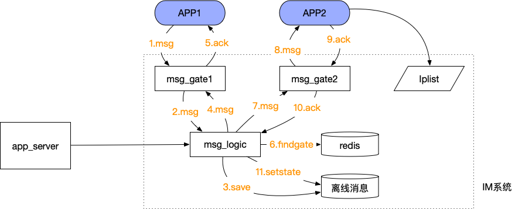
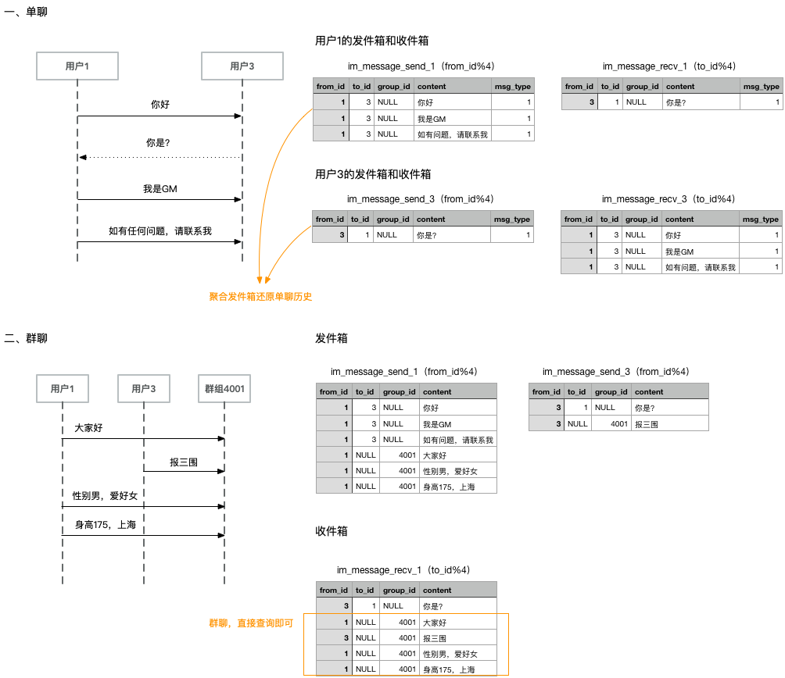

## 常见IM技术难点
参考：http://www.52im.net/thread-294-1-1.html
>《IM消息送达保证机制实现(一)：保证在线实时消息的可靠投递》  
>《IM消息送达保证机制实现(二)：保证离线消息的可靠投递》  
>《如何保证IM实时消息的“时序性”与“一致性”？》  
>《IM单聊和群聊中的在线状态同步应该用“推”还是“拉”？》  
>《IM群聊消息如此复杂，如何保证不丢不重？》  
>《一种Android端IM智能心跳算法的设计与实现探讨（含样例代码）》  
>《移动端IM登录时拉取数据如何作到省流量？》  
>《通俗易懂：基于集群的移动端IM接入层负载均衡方案分享》  
>《浅谈移动端IM的多点登陆和消息漫游原理》  
>《IM开发基础知识补课(一)：正确理解前置HTTP SSO单点登陆接口的原理》  
>《IM开发基础知识补课(二)：如何设计大量图片文件的服务端存储架构？》  
>《IM开发基础知识补课(三)：快速理解服务端数据库读写分离原理及实践建议》  
>《IM开发基础知识补课(四)：正确理解HTTP短连接中的Cookie、Session和Token》  
>《IM群聊消息的已读回执功能该怎么实现？》  
>《IM群聊消息究竟是存1份(即扩散读)还是存多份(即扩散写)？》  
>《IM开发基础知识补课(五)：通俗易懂，正确理解并用好MQ消息队列》  
>《一个低成本确保IM消息时序的方法探讨》  

梳理如下：  


### 重复  
  
由于网络的不可靠性，如果在如上图的环节5(ack)丢包，则会出现服务端认为消息发送成功，但是客户端认为消息发送失败的问题。当客户端重试后，如果不进行处理，则会在数据库出现2条相同的消息，所以需要一种机制来解决这个问题。

### 时序性  
具体见：低成本确保消息时序的方法 https://mp.weixin.qq.com/s/QtlgYtfek4Sv8Ss5b8ojxA  


引用：
```bash
IM类系统中，都需要考虑消息时序问题，如果后发送的消息先显示，可能严重扰乱聊天消息所要表达的意义。

消息时序是分布式系统架构设计中非常难的问题，一个分布式的IM系统必须要解决这个问题。

IM系统中主要有两类消息
（1）单聊消息，两个人之间的聊天。需要确保发送方和接收方消息时序展示一致。
（2）群聊消息，一群人在一起聊天。需要确保所有接收方消息顺序一致。

一、为什么会出现时序问题
1、时间不一致。
IM系统存在大量的客户端、IM服务器集群、长连接接入层集群、短连接接入层集群、数据库集群，这些应用分布在不同的机器上，时间很可能
不一致，时区也可能不一致。

2、网络传输
网络传输延迟不同。同一用户后发送的消息可能早与先发送的消息到达服务器；不同用户的发送的消息到达服务器的延时差异可能更大。如下
图，msg1先发送，msg2后发送。由于网络原因，可能msg2先到达消息服务器

3、服务集群时差
由于IM服务器分布式部署，不同的消息可能路由到不同的逻辑层处理。路由到不同logic的时延不同（尤其是跨机房），且不同logic之间存
在微量时差。

4、消息处理速度不一致
服务器收到消息后，不同logic，不同线程对消息的处理速度可能不同，导致投递消息的时序出现错乱。
```

## 如何解决这些问题？  
参考《微信技术分享：微信的海量IM聊天消息序列号生成实践（算法原理篇）》

引用：
```bash
对于IM系统来说，如何做到IM聊天消息离线差异拉取（差异拉取是为了节省流量）、消息多端同步、消息顺序保证等，是典型的IM技术难点。

上面这些文章所涉及的IM聊天消息的省流量、可靠投递、离线拉取、时序性、一致性、多端同步等等问题，总结下来其实
就是要解决好一个问题：即如何保证聊天消息的唯一性判定和顺序判定。

很多即时通讯网的群友在讨论这个问题的时候，普遍考虑的是使用整型自增序列号作为消息ID（即MsgId）：这样既能保证消息的唯一性
又方便保证顺序性，但问题是在分布式情况下是很难保证消息id的唯一性且顺序递增的，维护id生成的一致性难度太大了（网络延迟、调
试出错等等都可能导致不同的机器取到的消息id存在碰撞的可能）。

不过，通过本文中微信团队分享的微信消息序列号生成思路，实际上要解决消息的唯一性、顺序性问题，可以将一个技术点分解成两个：
即将原先每条消息一个自增且唯一的消息ID分拆成两个关键属性——消息ID（msgId）、消息序列号（seqId），即消息ID只要保证唯一
性而不需要兼顾顺序性（比如直接用UUID）、消息序列号只要保证顺序性而不需要兼顾唯一性（就像本文中微信的思路一样），这样的技
术分解就能很好的解决原本一个消息ID既要保证唯一性又要保证顺序性的难题。

那么，如何优雅地解决“消息序列号只要保证顺序性而不需要兼顾唯一性”的问题呢？这就是本文所要分享的内容，强烈建议深入理解和阅读。 
```


文章里巧妙的提出了针对ID的唯一性（消息去重逻辑）使用UUID来做，针对顺序性使用序列号来做。  
所以一条IM消息要包含2个字段：MsgId（UUID）+SeqId，其中MsgId是string类型,SeqId是int类型。  

其中SeqID的生成，《低成本确保消息时序的方法》文章给出的思路是：  
```txt
2、单聊时序
用户1发送消息时，确保每条消息的seq号递增（如果系统重装，需要客户端将seq写成文件保存，重装后能够继续seq递增）。

消息发送到服务器后，因为网络及分布式原因，可能造成服务器接收消息时序错乱
服务器推送消息给用户2，可能因为网络原因再次出现时序错乱。用户2，需要根据seq对消息显示时序进行修正。

注：对于seq归0的情况（比如，记录seq的文件被删除），用户2需要结合timestamp时间及seq，共同判断消息时序

3、群聊消息
群聊不能再利用发送方的seq来保证时序，因为发送方不单点，时间也不一致。
群聊消息以服务器收到发送消息的顺序为准，服务器为每条消息生成时间有序的msgid，客户端以msgid大小顺序来排序即可。
```

## 如何生成SeqID（分布式ID）
《ID生成策略——SnowFlake》提到，有下列几种方案：
```txt
1、数据库自增ID
某个项目采用了数据库（MySQL）自增ID作为主要业务数据的主键。数据库自增ID使用简单，自动编号，速度快，而且是增量增长，按顺序存
放，对于检索非常有利。

单库环境下，数据库自增ID问题不大。但在分布式环境或分库分表环境下，数据库自增ID逐渐暴露出一些问题。例如，分库分表的情况下保证
ID唯一变得困难；订单号等业务数据如果用数据库自增ID，竞对很容易算出大概的业务量。

2、UUID（不是int，放弃）
算法的核心思想是结合机器的网卡、当地时间、一个随记数来生成UUID。
优点：本地生成，生成简单，性能好，没有高可用风险
缺点：长度过长，存储冗余，且无序不可读，查询效率低

3、Redis生成ID
Redis生成ID可以看做数据库自增ID的升级版。Redis的所有命令操作都是单线程的，本身提供像 incr 和 increby 这样的自增原子命
令，所以能保证生成的 ID 肯定是唯一有序的。

优点：不依赖于数据库，灵活方便，且性能优于数据库；数字ID天然排序，对分页或者需要排序的结果很有帮助。
缺点：如果系统中没有Redis，还需要引入新的组件，增加系统复杂度；需要编码和配置的工作量比较大。

考虑到单节点的性能瓶颈，可以使用 Redis 集群来获取更高的吞吐量。假如一个集群中有5台 Redis。可以初始化每台 Redis 的值分别是
1, 2, 3, 4, 5，然后步长都是 5。各个 Redis 生成的 ID 为

4、Twitter的snowflake算法。
```

考虑到实现成本和复杂度，我们使用Redis来生成。我们为每一对用户维护一个ID，每个群组维护一个ID，通过redis的INCRY自增长即可。  
举例如下：
> 单聊redis key规则：msg_id_single_[smallId]_[bigId]，如：msg_id_single_1008_1009  
> 群聊redis key规则：msg_id_group_[groupId]，如：msg_id_group_3  

路由问题补充说明（分库分表如何计算表名？）：
> 针对群聊，永远根据groupId%4计算得到存储的im_message_rece_x表名  
> 针对单聊，from_id%4存储到im_message_send_x表，to_id%4存储到im_message_rece_x表  
> 
> 会话查询的适合，如何得到最新的消息呢？  
> 答：因为不知道最新的消息是放在send表还是recv表，所以需要查2遍，因为单聊共用1个msgId，所以不会命中2次

至于单聊为何要如此计算，解释如下：
> 因为涉及到2个userId，参考《瓜子IM》分表存储实施，一个消息存2份。举例A发给B的消息，根据A%4，在send表中存储“A发给B一条消息”，根据B%4在recv表中存储一份“B收到一条来自于A的消息”。反正B发给A也是一样的。这样会存在1个问题，就是
> send表通过from_id%4路由，recv表通过to_id%4路由

图解：  


当然，对于单聊和群聊都通过此方式实现。为何单聊不通过客户端的Seq来实现？  
- 类似于Websocket没有存储功能，所以要需要服务端存储，增加额外的成本  
- 单聊在正常用户输入的情况下，打字需要一定的时间，2条消息至少间隔1秒钟，所以乱序概率降低

## 给MsgID和SeqID起个好名字
参考网易云IM的API，我们发现：
```c++
NIMResCode 	rescode_
NIMMessageFeature 	feature_
NIMSessionType 	session_type_
std::string 	receiver_accid_
std::string 	sender_accid_
int64_t 	timetag_
std::string 	content_
NIMMessageType 	type_
std::string 	attach_
std::string 	client_msg_id_           // msgId
MessageSetting 	msg_setting_
std::string 	local_res_path_
std::string 	local_talk_id_
std::string 	local_res_id_
NIMMsgLogStatus 	status_
NIMMsgLogSubStatus 	sub_status_
NIMClientType 	readonly_sender_client_type_
std::string 	readonly_sender_device_id_ 
std::string 	readonly_sender_nickname_
int64_t 	readonly_server_id_                // seqId
```

所以，我们用ClientMsgID来表示上文中的MsgID，MsgServerId来表示上文中的SeqID是不是更合理？