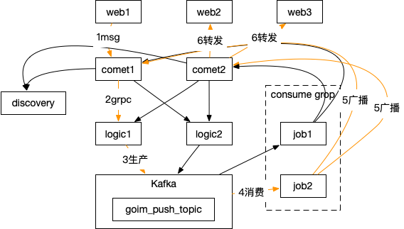

# 背景
作者对TeamTalk的架构比较熟悉，并且在生产环境稳定运行了大半年的时间。随着需求的实现以及服务的增多，遇到了一些挑战：
1. 团队人员扩充，如何并行开发并且保证核心服务的稳定？
2. 开发新需求，改几行代码就导致了进程的崩溃，从而影响系统的可用性？
3. 服务有状态，需要运维做主备，如何解决单点问题？
4. 如何与Java后台通信，写HTTP接口相互调用？写一个中间服务，使用RPC（Dubbo-go）优化HTTP性能？
4. ……

其实上述的问题只是一方面，最主要的是作者之前从事过大数据应用相关的开发，对Kafka/RocketMQ等比较感兴趣😊，所以借着这个开源项目的机会实践一下。  

初步想法是在Gate和Logic之间引入MQ，有以下好处（[一个用消息队列 的人，不知道为啥用 MQ，这就有点尴尬](https://www.cnblogs.com/williamjie/p/9481780.html)）：
- 削峰。避免并发高的情况下所有请求怼到MYSQL造成异常，而是通过一个缓冲池子，平稳的按照数据库的最高性能写入
- 解耦。不限开发语言，新的需求可以新写一个进程实现变得很容易且不影响核心服务的稳定性，比如这里登录、单聊和群聊就可以分成3个服务（进程）
- 异步。原来可能需要调几个接口完成一件事情，现在只需要往MQ里面扔就可以了。PS：一般情况下不会这样干，否则就出现了一致性的问题。
- 吞吐量。

当然，坏处也很明显：
- 引入了额外的复杂性
    - RocketMQ如何确保高可用？是不是需要集群？
    - 一致性问题。如何确保生产到MQ之后消费者成功入库了？（答案：MQ事物消息）
    - 幂等问题。如果因为网络或者程序BUG造成消费者明明已消费，但是生产者以为消息丢失了，又写入了一份，如何解决重复消费的问题？
- 中间多了一个环节，调试变得困难了？
- 对于入门级的云主机，可能1台就跑不动了

考虑到引入MQ的优缺点，所以新起一个分支来试验一下。

# 方案分析
## goim
  

goim是bilibili技术总监毛剑的开源聊天室项目，号称支持100万用户在线，在仔细的梳理了goim的业务流程（在聊天室发一条消息）后绘制出了上面的架构图(图2)。    
黄线代表一条聊天室消息经过的链路。comet是接入层，负责管理维护客户端的TCP/WebSocket连接等。logic是业务逻辑，比如登录、发消息等。job负责从Kafka消费消息，然后广播到所有comet上。discovery是bilibili开源的类似Zookeeper的服务注册与发现模块，这样comet、logic等都可以很方便的动态扩容。  

## 其他

"普通程序员"微信公众号上分享的文章和goim架构类似，都是grpc+mq的混合方式。

## 最终设计

分步骤来验证：
1. 先在 Gate 和 Logic 之间引入MQ，Gate与Gate之间广播继续通过Router实现。
2. Router也从MQ消费，然后广播，类似goim的流程。

# MQ选型
## RocketMQ VS Kafka

参考：  
[RocketMQ与Kafka对比（18项差异）](https://blog.csdn.net/damacheng/article/details/42846549)  
[Kafka、RabbitMQ、RocketMQ等消息中间件的对比](https://blog.csdn.net/belvine/article/details/80842240)

最后，根据团队技术栈以及Kafka和RocketMQ的源码语言和适用场景，初步决定适用RocketMQ。

## 为什么选择RocketMQ
### 源代码
RocketMQ是Java写的，结合《RocketMQ技术内幕》能比较深入的研究MQ的原理，更好的掌握RocketMQ，提前避免一些问题。  
而Kafka是用Scala和Java写的，阅读源码门槛相对更高一点。

### 团队技术栈
所在团队以电商业务为主，而RocketMQ历经双十一的洗礼，天然适合电商场景。

### 单机支持的队列数
根据[RocketMQ与Kafka对比（18项差异）](https://blog.csdn.net/damacheng/article/details/42846549)上的描述：
- Kafka单机超过64个队列/分区，Load会发生明显的飙高现象，队列越多，load越高，发送消息响应时间变长
- RocketMQ单机支持最高5万个队列，Load不会发生明显变化

### 消息顺序
- Kafka支持消息顺序，但是一台Broker宕机后，就会产生消息乱序
- RocketMQ支持严格的消息顺序，在顺序消息场景下，一台Broker宕机后，发送消息会失败，但是不会乱序

> Mysql Binlog分发需要严格的消息顺序

### 消息投递实时性
- Kafka使用短轮询方式，实时性取决于轮询间隔时间
- RocketMQ使用长轮询，同Push方式实时性一致，消息的投递延时通常在几个毫秒。